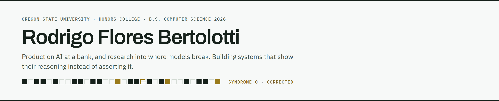

<!--
  Profile README — rendered at https://github.com/rfbert
  Voice: substance first, no vanity metrics. Mirrors rfbert.me.
  Banner art is generated from the site's own SEC-DED palette and typefaces.
-->

<picture>
  <source media="(prefers-color-scheme: dark)" srcset="assets/banner-dark.png">
  
</picture>

**Rodrigo Flores Bertolotti** — Computer Science at Oregon State, Honors College, 4.0, expected June 2028.

**Open to Summer 2027 internships** — AI product management, AI/ML engineering, software engineering, AI research.

### When does a model's output stop meaning what it says?

I come at that from both ends.

**Attacking it.** In the lab I flip individual bits inside an LLM's weights to find the few that turn a fluent model into a confidently wrong one, then measure which defenses actually survive it.

**Auditing it.** In the products I build, a score is never shown as a bare number. Its components are drawn as spectral lines, so you can see whether a 78 is eight signals agreeing or a dream role averaged against a company that never sponsors.

A number you can't inspect is a number that can fail quietly.

---

**Now**

`TRUE AI Lab, Oregon State` — Undergraduate research assistant, LLM fault resilience. Built a gradient-guided bit-flip attack framework and a draft-model-gated decoding defense, then benchmarked 7 fault-tolerance methods against 2 classes of adversarial attack on an HPC Slurm cluster. Co-author on a cross-scale model resilience manuscript. Code stays private until publication.

`Mibanco (Credicorp)` — AI intern at Peru's largest microfinance bank. Built a parallelized audio-ingestion and speech-to-text pipeline on Databricks (Python, SQL, Azure AI), with LLM-based interpretation feeding production workflows.

---

**Selected work**

**[internship-scout](https://github.com/rfbert/internship-scout)** — a full-stack agent that reads the internship market every morning. It scrapes job boards, dedupes across sources, applies deterministic eligibility gates, scores what survives 0–100 with an explainable weighted breakdown and an evidence-citing LLM sponsorship analysis, and tracks applications on a kanban board. Runs are idempotent; Vitest and Playwright gate CI.

<sub>TypeScript · Next.js 16 · Prisma · PostgreSQL · Docker · GitHub Actions</sub>

I built it because I'm an international student on an F-1 visa, so sponsorship isn't a preference in my search — it's a filter. A filter that strict should have to cite its evidence.

A single number hides how it was made, so the score doesn't stop at the number. Each of the eight weighted components is drawn as an emission line on a 0–100 axis inside a dark instrument well.

```
            0                          50                        100
            ├───────────────────────────┼──────────────────────────┤
78  TIGHT   ······································│·│││·││││········
78  SPLIT   ··│·│···········································│·│││││·
```

Both listings score 78. The first is corroborated — every signal agrees, and the number means what it says. The second is the average of an argument. That spread is promoted to a first-class metric, dispersion (σ), tagged `TIGHT` / `MIXED` / `SPLIT` and sortable, so the two never look alike again.

**[rfbert.me](https://rfbert.me)** — portfolio, designed and built end to end.

<sub>Astro 5 · Tailwind v4 · build-time OG images · static deploy</sub>

---

**Toolbox**

`Python` `TypeScript` `SQL` `C++` · `PyTorch` `Hugging Face` `Slurm/HPC` · `Next.js` `PostgreSQL` `Docker` · `Databricks` `Azure AI`

---

[rfbert.me](https://rfbert.me) · [LinkedIn](https://www.linkedin.com/in/rodrigo-bertolotti) · [Résumé](https://rfbert.me/resume.pdf) · [rf.bertolotti@gmail.com](mailto:rf.bertolotti@gmail.com)
